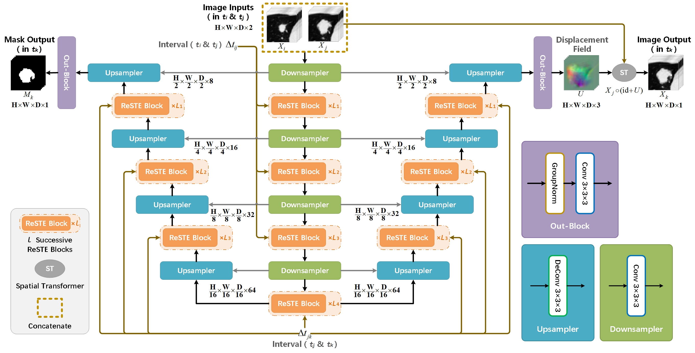
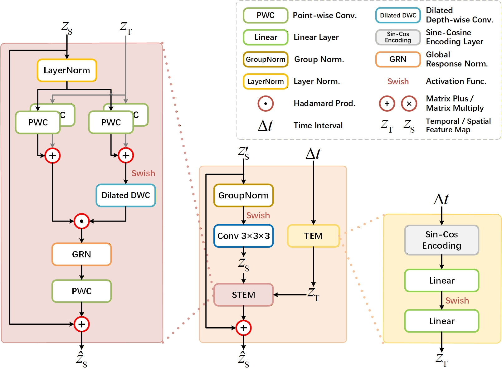

# NGP-Net (IEEE TMI 2026)
Official Pytorch implementation of NGP-Net, from the following paper:

**NGP-Net: A Lightweight Growth Prediction Network for Pulmonary Nodules**

[IEEE TMI](https://ieeetmi.org/) (Accepted at 20 Jan. 2026, [Regular Paper](https://ieeexplore.ieee.org/document/11359361))

[Xinkai Tang](https://xinkai-tang.github.io)<sup>1📝</sup>, Zhiyao Luo<sup>2📝</sup>, Feng Liu<sup>1📧</sup>, Wencai Huang<sup>3</sup>, Jiani Zou

> <sup>1</sup> School of Computer Science, Wuhan University, China .  
<sup>2</sup> Department of Engineering Science, University of Oxford, UK .  
<sup>3</sup> Department of Radiology, General Hospital of Central Theater Command of the PLA, China .  
<sup>📝</sup> Xinkai Tang and Zhiyao Luo are the co-first authors.  
<sup>📧</sup> Feng Liu is the corresponding author.  


## Introduction



We propose NGP-Net, a novel W-shaped deep learning architecture specifically designed for dynamic nodule growth prediction by directly modelling irregularly spaced longitudinal CT data. Unlike previous methods reliant on fixed growth metrics such as volumetric or mass-change rates, NGP-Net innovatively integrates temporal sensitivity into its predictive framework through a Spatial-Temporal Encoding Module (STEM) based on dilated depthwise separable convolutions. Furthermore, NGP-Net employs a dual-branch decoder to reconstruct high-fidelity textures and shapes of nodules at arbitrary future time intervals, significantly enhancing interpretability and clinical applicability. 




## The PNG Dataset
Under the premise of strictly adhering to medical ethics principles, we collect a practical follow-up dataset, named **Pulmonary Nodule Growth (PNG)**, for pulmonary nodules with our cooperating hospital. The dataset contains *378* chest CT scans from $103$ patients with a total of *226* long-standing pulmonary nodules. Each nodule has at least three time-points of follow-up records, with an interval between $2$ and $64$ months, and all the nodules are annotated and checked by seven radiologists. Further details about PNG dataset can be found in [KAGGLE](https://kaggle.com/datasets/eb40d82b3bdd92bcdd202c50092443a8280a039f70fd96f2ad0cbc988ae57ca7).


## Prediction Results

### Overall Performance
Comparison of methods in terms of Dice Similarity Coefficient (DSC), Sensitivity (SEN), Positive Predictive Value (PPV), Peak Signal-to-Noise Ratio (PSNR), Structural Similarity (SSIM), and Mean Square Errors in overall (MSE<sub>ROI</sub>) and nodule (MSE<sub>PN</sub>) regions. The values (described in "mean ± standard deviation") in the table are obtained by averaging the 5-fold cross-validation results, respectively.
| Methods     | Param.  | FLOPs      | DSC(%)↑           | SEN(%)↑           | PPV(%)↑           | PSNR(dB)↑        | SSIM(%)↑          | MSE<sub>ROI</sub>(×10⁻³)↓   | MSE<sub>PN</sub>(×10⁻⁴)↓    |
|-------------|---------|------------|-------------------|-------------------|-------------------|------------------|-------------------|------------------|-----------------|
| WarpNet     | 0.48 M  | 11.70 G    | 50.78 ± 16.19     | 52.29 ± 21.15     | 56.19 ± 19.56     | 21.62 ± 3.64     | 63.08 ± 15.93     | 9.81 ± 10.0      | 7.87 ± 30.0     |
| NoFoNet     | 0.95 M  | 23.28 G    | 50.78 ± 16.19     | 52.29 ± 21.15     | 56.19 ± 19.56     | 21.63 ± 3.61     | 63.17 ± 15.90     | 9.80 ± 9.99      | 7.86 ± 29.8     |
| PredNet     | 0.49 M  | 11.70 G    | 46.45 ± 14.14     | 49.62 ± 20.48     | 52.67 ± 20.04     | 19.99 ± 2.88     | 56.34 ± 12.80     | 12.3 ± 8.54      | 6.77 ± 36.4     |
| GM-AE       | 37.41 M | 724.79 G   | 61.64 ± 12.19     | 69.07 ± 16.45     | 60.84 ± 18.32     | 22.83 ± 2.98     | 65.74 ± 12.36     | 6.37 ± 3.92      | 30.5 ± 18.7     |
| LNGNet      | 202.0 M | 117.24 G   | 59.46 ± 12.01     | 68.23 ± 16.54     | 58.13 ± 18.75     | 22.89 ± 2.96     | 66.31 ± 12.18     | 6.24 ± 3.83      | 31.4 ± 19.1     |
| STGNet      | 37.40 M | 724.85 G   | 61.23 ± 12.21     | 68.96 ± 16.56     | 60.34 ± 18.53     | 22.83 ± 2.98     | 65.74 ± 12.36     | 6.37 ± 3.92      | 30.5 ± 18.8     |
| **NGP-Net** | 1.98 M  | **1.28 G** | **72.19 ± 23.40** | **75.00 ± 22.92** | **74.95 ± 21.92** | **23.18 ± 2.94** | **72.25 ± 11.52** | **6.13 ± 4.77**  | **1.28 ± 7.44** |

### Performance on Distinct Growth Patterns
Growth prediction results of pulmonary nodules with different growth patterns (**34** dilation cases; **41** shrinkage cases; **75** stability cases) on the test dataset. The values (described in "mean ± standard deviation") in the table are obtained by averaging the 5-fold cross-validation results, respectively.
| Pattern   | Methods     | DSC(%)↑          | SEN(%)↑          | PPV(%)↑          | PSNR(dB)↑        | SSIM(%)↑         | MSE<sub>ROI</sub>(×10⁻³)↓   | MSE<sub>PN</sub>(×10⁻⁴)↓    |
|-----------|-------------|------------------|------------------|------------------|------------------|------------------|------------------|------------------|
| Dilation  | GM-AE       | **63.02 ± 11.52** | 61.15 ± 15.24     | 69.31 ± 16.14     | 23.07 ± 3.94     | 64.09 ± 15.57     | 6.63 ± 4.46      | 31.5 ± 21.0      |
|           | LNGNet      | 61.77 ± 10.86     | 59.59 ± 14.92     | 69.16 ± 16.41     | **23.13 ± 3.88** | 64.94 ± 15.37     | **6.50 ± 4.37**  | 32.5 ± 21.8      |
|           | STGNet      | 62.76 ± 11.63     | 60.62 ± 14.88     | 69.16 ± 16.21     | 23.07 ± 3.94     | 64.09 ± 15.57     | 6.63 ± 4.47      | 31.6 ± 21.1      |
|           | **NGP-Net** | 61.89 ± 22.56     | **61.58 ± 24.73** | **70.64 ± 20.56** | 22.96 ± 3.42     | **71.05 ± 13.43** | 6.69 ± 4.79      | **2.56 ± 7.13**  |
| Shrinkage | GM-AE       | 55.99 ± 12.42     | 76.96 ± 13.59     | 46.28 ± 14.67     | 22.57 ± 2.74     | 65.19 ± 11.43     | 6.67 ± 4.20      | 32.1 ± 20.1      |
|           | LNGNet      | 54.18 ± 11.80     | 76.20 ± 14.05     | 44.21 ± 13.58     | 22.62 ± 2.72     | 65.51 ± 11.23     | 6.55 ± 4.01      | 32.8 ± 20.1      |
|           | STGNet      | 55.59 ± 12.38     | **77.03 ± 13.64** | 45.76 ± 14.49     | 22.57 ± 2.74     | 65.19 ± 11.43     | 6.67 ± 4.20      | 32.1 ± 20.1      |
|           | **NGP-Net** | **68.81 ± 21.04** | 75.03 ± 18.35     | **65.37 ± 21.49** | **22.63 ± 2.34** | **69.99 ± 10.20** | **6.39 ± 3.32**  | **0.24 ± 0.41**  |
| Stability | GM-AE       | 64.11 ± 11.23     | 68.34 ± 16.39     | 64.95 ± 16.30     | 22.86 ± 2.55     | 66.80 ± 10.93     | 6.08 ± 3.42      | 29.2 ± 16.5      |
|           | LNGNet      | 61.30 ± 11.66     | 67.80 ± 16.31     | 60.73 ± 17.54     | 22.92 ± 2.54     | 67.37 ± 10.79     | 5.99 ± 3.39      | 30.0 ± 17.0      |
|           | STGNet      | 63.63 ± 11.27     | 68.33 ± 16.58     | 64.32 ± 16.77     | 22.86 ± 2.55     | 66.80 ± 10.94     | 6.08 ± 3.42      | 29.2 ± 16.5      |
|           | **NGP-Net** | **79.79 ± 22.21** | **81.06 ± 21.54** | **82.15 ± 20.01** | **23.58 ± 2.92** | **74.04 ± 10.89** | **5.73 ± 5.33**  | **1.27 ± 9.25**  |


## Acknowledgement
This work is supported by National Natural Science Foundation of China (NSFC No.62172309).


## Ethical Approval
This study involving humans was approved by Medical Ethics Committee, General Hospital of Central Theater Command of the PLA, China, under Grant [2020]035-1. It was conducted in accordance with the local legislation and institutional requirements. The ethics committee/institutional review board waived the requirement of written informed consent for participation from the participants or the participants' legal guardians/next of kin because Retrospective data collection; no influence on patient treatment/care.


## Citation 
If you find this repository helpful, please consider citing:
```
@inproceedings{tang2026ngpnet,
  author={Tang, Xinkai and Luo, Zhiyao and Liu, Feng and Huang, Wencai and Zou, Jiani},
  journal={IEEE Transactions on Medical Imaging}, 
  title={NGP-Net: a Lightweight Growth Prediction Network for Pulmonary Nodules}, 
  year={2026},
  volume={},
  number={},
  pages={1-1},
  organization={IEEE},
  doi={10.1109/TMI.2026.3656184}
}
```


## Our Previous Works
🥇**X. Tang**, F. Liu, R. Kong, *et al*. ConvUNET: a Novel Depthwise Separable ConvNet for Lung Nodule Segmentation [C]//IEEE International Conference on Bioinformatics and Biomedicine (BIBM). IEEE, 2023: 1443-1450. \[[paper](https://ieeexplore.ieee.org/document/10385928)|[code](https://github.com/XinKai-Tang/ConvUNET)\]

🥈**X. Tang**, Z. Zhu, S. Guo, *et al*. PN-Quant: An Automated Pulmonary Nodule Quantification Method for Full-Size CT Scans [C]//IEEE International Conference on Bioinformatics and Biomedicine (BIBM). IEEE, 2024: 2474-2480. \[[paper](https://ieeexplore.ieee.org/document/10822571)|[code](https://github.com/XinKai-Tang/PN-Quant)\]
